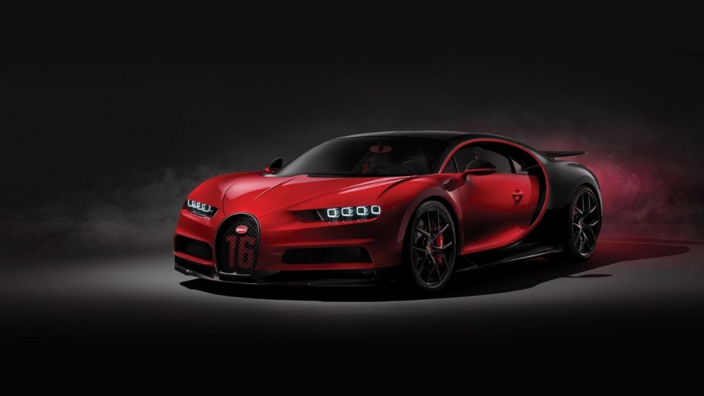
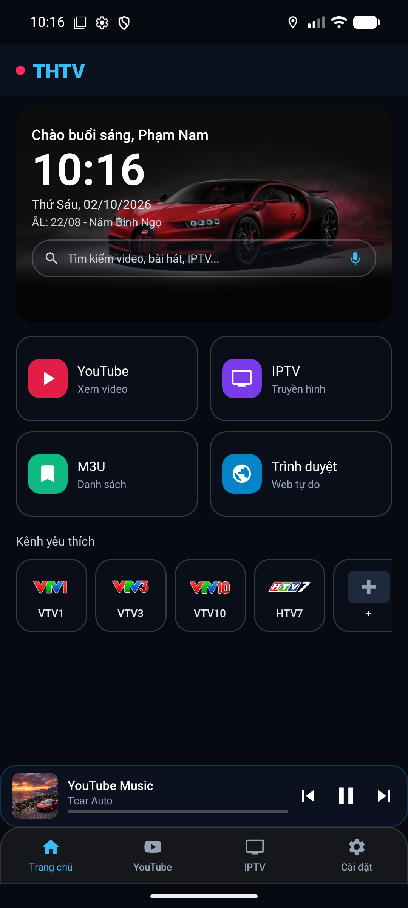
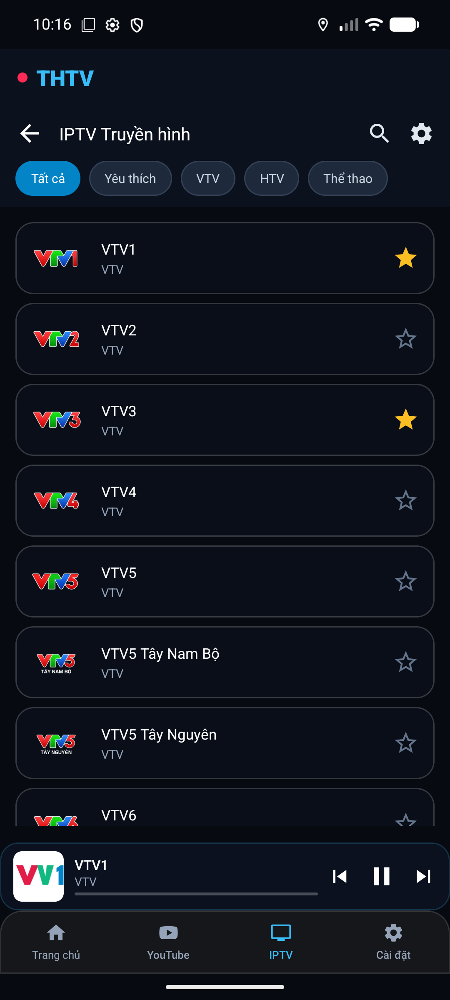
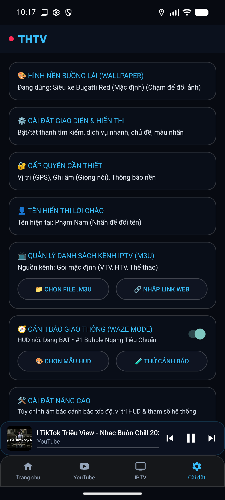

# 🚘 THTV PRO - Android Auto Multimedia Dashboard & Waze/Vietmap HUD

[](https://github.com/ledinhtien219/THTV/actions/workflows/build-apk.yml)
[](https://github.com/ledinhtien219/THTV/releases)
[](https://developer.android.com)

**THTV PRO** là ứng dụng dashboard đa phương tiện dành cho **Android Auto / màn hình xe**, kết hợp YouTube, IPTV, trình duyệt WebApp, điều khiển giọng nói và HUD cảnh báo giao thông từ Waze/Vietmap.

## ✅ Phiên bản stable hiện tại trong source

- **Version:** `v1.0.39`
- **Build:** `226`
- **Branch:** `main`
- **Application ID:** `com.tcar.auto`
- **Min SDK:** Android 10 / API 29
- **Target SDK:** API 35
- **Stable source merge:** `ee453b286c24823ae5109e23454290938bbaf13c`

> Lưu ý: source trên `main` và bản public OTA/Release là hai bước tách biệt. Bản public chỉ được đổi sau khi chạy workflow **Approve Stable Update**, workflow này sẽ xác minh đúng commit/version đã test trước khi cập nhật `update.json`.

---

## 📸 Giao diện

### 🏎️ Android Auto / màn hình xe

<div align="center">

| 🖥️ Dashboard buồng lái | 🚗 Hiển thị thực tế trên xe |
| :---: | :---: |
|  |  |
| *Dashboard đa phương tiện, GPS speed, YouTube, IPTV, WebApp, HUD cảnh báo* | *THTV chạy trên Android Auto / Screen Projection* |

</div>

### 📱 Ứng dụng điện thoại

<div align="center">

| 🏠 Điều khiển chính | 📺 IPTV | ⚙️ Cài đặt |
| :---: | :---: | :---: |
|  |  |  |

</div>

---

## 🌟 Tính năng nổi bật

### 📺 YouTube trên Android Auto

- Chặn nhiều nguồn quảng cáo và hỗ trợ SponsorBlock.
- Tìm kiếm bằng bàn phím hoặc giọng nói tiếng Việt.
- Nút **Mic/Giọng nói** nằm ngay dưới nút **Trang chủ** trên thanh công cụ YouTube.
- Hỗ trợ Phát/Dừng, Tiếp theo và chọn chất lượng.
- **Giữ session YouTube** khi chuyển qua app khác:
  - giữ trang/video đang xem,
  - giữ history,
  - giữ vị trí phát,
  - tránh callback restore cũ chạy nhầm sau khi đã chuyển app.

### 📺 IPTV / M3U

- Phát danh sách M3U/M3U8 và HLS.
- Hỗ trợ chọn nhanh kênh từ Dashboard.
- Ghi nhớ trạng thái/kênh phù hợp trong luồng sử dụng.
- Tối ưu chuyển Dashboard ↔ IPTV để tránh rebuild/fullscreen lặp.
- Hỗ trợ điều chỉnh tỷ lệ video.

### 🌐 Trình duyệt & WebApp

- WebView dùng chung cho trải nghiệm trên màn hình xe nhưng **Browser và YouTube có session riêng**.
- Khi chuyển Browser → YouTube → Browser, trang cũ, history và vị trí scroll được khôi phục.
- App Grid cho phép mở WebApp tùy chỉnh và thêm URL mới.
- Hỗ trợ Desktop User-Agent cho WebApp cần giao diện máy tính.

### 🛡️ Waze / Vietmap HUD

- Nhận cảnh báo Waze HLP qua WebSocket thời gian thực.
- Fallback từ notification/broadcast khi HLP không có dữ liệu phù hợp.
- Priority nguồn dữ liệu: **HLP > broadcast > notification > GPS**.
- Đã harden các tình huống:
  - reconnect / Waze Mod restart,
  - timestamp rollback,
  - cảnh báo stale theo TTL,
  - cảnh báo trùng,
  - không gộp nhầm 2 camera cùng loại nhưng ở xa nhau,
  - `distance = 0` không làm clear cảnh báo quá sớm,
  - notification bị remove sẽ dọn đúng alert thuộc nguồn đó.
- HUD trên Android Auto **không còn nút X**; bật/tắt HUD được quản lý từ app điện thoại.
- Vẫn giữ nút khóa vị trí HUD.

### 🎙️ Giọng nói & phím vô lăng

- Tìm kiếm giọng nói tiếng Việt.
- Điều khiển MediaSession / phím Next / Play-Pause.
- Bộ gõ Telex tiếng Việt trên màn hình xe.
- Voice query có thể mở YouTube hoặc kênh IPTV phù hợp.

### 🎛️ Dashboard buồng lái

- Đồng hồ lớn, ngày dương + âm lịch Việt Nam.
- Weather card dùng **vector weather icon**.
- Weather card stable mới dùng hiệu ứng **glass nhẹ / bán trong suốt**, giữ dễ đọc trên wallpaper sáng và tối.
- Wallpaper tĩnh / ảnh tùy chỉnh / GIF / video.
- Chế độ ngày / đêm / tự động.
- Mini player giữ điều khiển media ngay trên Dashboard.

### 🧩 Ổn định & chẩn đoán

- `AppCrashHandler.kt` lưu crash report theo version/build để kiểm tra lỗi cũ và mới.
- Android Auto NavigationTemplate đã được sửa các lỗi runtime từng xuất hiện ở Build 216/219.
- Session Browser/YouTube được snapshot khi Android Auto đưa THTV xuống nền.
- Stable signing dùng cùng debug certificate trong CI để tránh lỗi cài đè giữa các build nội bộ.

---

## 📂 Cấu trúc chính

```text
THTV/
├── .github/workflows/
│   ├── build-apk.yml                  # Build nội bộ + regression/unit/androidTest compile
│   └── approve-stable-update.yml      # Promote đúng bản đã test thành public stable
├── app/
│   ├── build.gradle.kts               # v1.0.39 / Build 226 trên main
│   └── src/main/
│       ├── AndroidManifest.xml
│       ├── assets/                    # IPTV player, web assets...
│       ├── java/com/carhud/aaproxy/
│       │   ├── MainActivity.kt
│       │   ├── SettingsActivity.kt
│       │   ├── CarPresentation.kt
│       │   ├── CarDashboardView.kt
│       │   ├── CarHudAutoService.kt
│       │   ├── CarHudAutoScreen.kt
│       │   ├── CarMediaBrowserService.kt
│       │   ├── CarMediaManager.kt
│       │   ├── YouTubePlayerHelper.kt
│       │   ├── YouTubeAdBlocker.kt
│       │   ├── SponsorBlockManager.kt
│       │   ├── IptvModel.kt
│       │   ├── WebAppModel.kt
│       │   ├── WazeHlpWebSocketManager.kt
│       │   ├── WazeAlertPolicy.kt
│       │   ├── WazeHudManager.kt
│       │   ├── VietmapHudOverlay.kt
│       │   ├── VietmapNotificationListenerService.kt
│       │   ├── VietmapState.kt
│       │   ├── VoiceSearchManager.kt
│       │   ├── VoiceQueryResolver.kt
│       │   ├── WeatherManager.kt
│       │   ├── VietnameseLunarHelper.kt
│       │   ├── GpsSpeedManager.kt
│       │   └── AppCrashHandler.kt
│       └── res/
├── tests/                              # Static regression tests
├── docs/images/
├── update.json                         # Manifest public stable đã được duyệt
└── settings.gradle.kts
```

---

## 🛠️ Build APK

Yêu cầu: **JDK 17**.

### Debug

```bash
./gradlew testDebugUnitTest assembleDebug
```

APK:

```text
app/build/outputs/apk/debug/THTV_v1.0.39_debug.apk
```

### Release

```bash
./gradlew assembleRelease
```

APK:

```text
app/build/outputs/apk/release/THTV_v1.0.39_release.apk
```

### Cài qua ADB

```bash
adb install -r app/build/outputs/apk/debug/THTV_v1.0.39_debug.apk
```

---

## 🧪 CI nội bộ

Workflow **Build Internal Test APK** chạy:

- regression IPTV aspect,
- page input,
- YouTube quality/search,
- home UI cleanup,
- Browser/YouTube session retention,
- app switching,
- YouTube voice toolbar,
- Waze stability,
- `testDebugUnitTest`,
- `assembleDebug`,
- `assembleDebugAndroidTest`.

Workflow này **không tự cập nhật OTA stable** và **không tự tạo public release**.

---

## 🚀 Duyệt một bản đã test thành Stable

Vào **Actions → Approve Stable Update → Run workflow**.

Các trường:

- **Commit SHA/tag/branch của đúng bản đã test:** commit SHA chính xác của APK đã test.
- **Version dự kiến:** ví dụ `1.0.39`.
- **Release notes:** mỗi dòng là một thay đổi chính.
- **Gõ chính xác:** `DUYET STABLE`.

Workflow sẽ:

1. checkout đúng commit đã test;
2. xác minh `versionName` / `versionCode`;
3. chạy lại test + build;
4. xác minh hoặc tạo GitHub Release;
5. cập nhật `update.json` trên `main`;
6. chỉ sau bước này người dùng mới nhận bản stable qua feed cập nhật.

---

## 📦 Releases

Bản phát hành public:

https://github.com/ledinhtien219/THTV/releases

Manifest OTA stable:

`update.json`

---

## 📄 Bản quyền

Dự án được xây dựng và tối ưu cho hệ sinh thái Android / Android Auto trên màn hình ô tô. Mọi quyền được bảo lưu.
